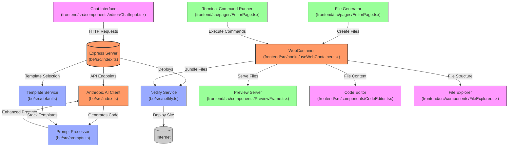

```mermaid
graph TB
    %% Core components
    ExpressServer[("Express Server<br/>(be/src/index.ts)")]
    AnthropicAI["Anthropic AI Client<br/>(be/src/index.ts)"]
    WebContainer["WebContainer<br/>(frontend/src/hooks/useWebContainer.tsx)"]

    %% Backend modules
    PromptProcessor["Prompt Processor<br/>(be/src/prompts.ts)"]
    TemplateService["Template Service<br/>(be/src/defaults)"]
    NetlifyService["Netlify Service<br/>(be/src/netlify.ts)"]

    %% Frontend modules
    FileGenerator["File Generator<br/>(frontend/src/pages/EditorPage.tsx)"]
    CommandRunner["Terminal Command Runner<br/>(frontend/src/pages/EditorPage.tsx)"]
    PreviewServer["Preview Server<br/>(frontend/src/components/PreviewFrame.tsx)"]

    %% Interfaces and utilities
    CodeEditor["Code Editor<br/>(frontend/src/components/CodeEditor.tsx)"]
    FileExplorer["File Explorer<br/>(frontend/src/components/FileExplorer.tsx)"]
    ChatInterface["Chat Interface<br/>(frontend/src/components/editor/ChatInput.tsx)"]

    %% Connections - Core Infrastructure
    ExpressServer -->|"API Endpoints"| AnthropicAI
    ExpressServer -->|"Template Selection"| TemplateService
    ExpressServer -->|"Deploys"| NetlifyService

    %% Connections - AI and Processing
    AnthropicAI -->|"Generates Code"| PromptProcessor
    PromptProcessor -->|"Enhanced Prompts"| AnthropicAI
    TemplateService -->|"Stack Templates"| PromptProcessor

    %% Connections - Frontend to Backend
    ChatInterface -->|"HTTP Requests"| ExpressServer

    %% Connections - WebContainer Management
    FileGenerator -->|"Create Files"| WebContainer
    CommandRunner -->|"Execute Commands"| WebContainer
    WebContainer -->|"Serve Files"| PreviewServer
    WebContainer -->|"File Structure"| FileExplorer
    WebContainer -->|"File Content"| CodeEditor

    %% Deployment Flow
    WebContainer -->|"Bundle Files"| NetlifyService
    NetlifyService -->|"Deploy Site"| Internet[("Internet")]

    %% Styling
    classDef core fill:#f96,stroke:#333,stroke-width:2px
    classDef backend fill:#9af,stroke:#333,stroke-width:1px
    classDef frontend fill:#9f9,stroke:#333,stroke-width:1px
    classDef interface fill:#f9f,stroke:#333,stroke-width:1px
    classDef external fill:#ccc,stroke:#333,stroke-width:1px

    class ExpressServer,AnthropicAI,WebContainer core
    class PromptProcessor,TemplateService,NetlifyService backend
    class FileGenerator,CommandRunner,PreviewServer frontend
    class CodeEditor,FileExplorer,ChatInterface interface
    class Internet external
```
