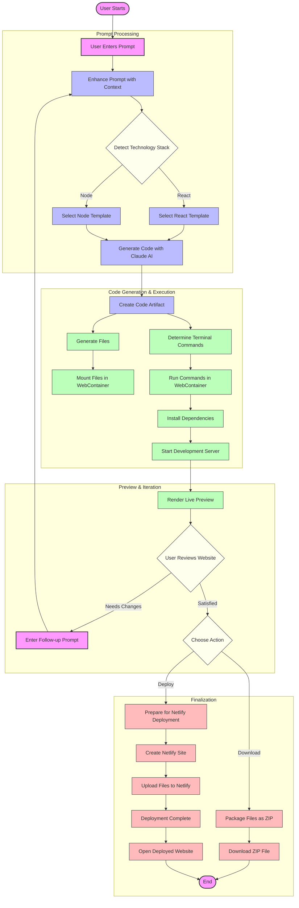

```mermaid
flowchart TD
    Start([User Starts]) --> InputPrompt[User Enters Prompt]

    subgraph "Prompt Processing"
        InputPrompt --> EnhancePrompt[Enhance Prompt with Context]
        EnhancePrompt --> DetectStack{Detect Technology Stack}
        DetectStack -->|React| SelectReactTemplate[Select React Template]
        DetectStack -->|Node| SelectNodeTemplate[Select Node Template]
        SelectReactTemplate --> GenerateCode
        SelectNodeTemplate --> GenerateCode
        GenerateCode[Generate Code with Claude AI]
    end

    subgraph "Code Generation & Execution"
        GenerateCode --> CodeArtifact[Create Code Artifact]
        CodeArtifact --> CreateFiles[Generate Files]
        CodeArtifact --> DetermineCommands[Determine Terminal Commands]
        CreateFiles --> MountWebContainer[Mount Files in WebContainer]
        DetermineCommands --> RunCommands[Run Commands in WebContainer]
        RunCommands --> InstallDeps[Install Dependencies]
        InstallDeps --> StartServer[Start Development Server]
    end

    subgraph "Preview & Iteration"
        StartServer --> RenderPreview[Render Live Preview]
        RenderPreview --> UserReview{User Reviews Website}
        UserReview -->|Needs Changes| FollowupPrompt[Enter Follow-up Prompt]
        FollowupPrompt --> EnhancePrompt
        UserReview -->|Satisfied| ChooseAction{Choose Action}
    end

    subgraph "Finalization"
        ChooseAction -->|Download| PackageFiles[Package Files as ZIP]
        PackageFiles --> DownloadZip[Download ZIP File]
        DownloadZip --> End([End])

        ChooseAction -->|Deploy| PrepareNetlify[Prepare for Netlify Deployment]
        PrepareNetlify --> CreateNetlifySite[Create Netlify Site]
        CreateNetlifySite --> UploadToNetlify[Upload Files to Netlify]
        UploadToNetlify --> DeploymentComplete[Deployment Complete]
        DeploymentComplete --> OpenDeployedSite[Open Deployed Website]
        OpenDeployedSite --> End
    end

    %% Styling
    classDef userActions fill:#f9f,stroke:#333,stroke-width:2px
    classDef aiProcessing fill:#bbf,stroke:#333,stroke-width:1px
    classDef containerOps fill:#bfb,stroke:#333,stroke-width:1px
    classDef deploymentOps fill:#fbb,stroke:#333,stroke-width:1px
    classDef decision fill:#ffe,stroke:#333,stroke-width:1px

    class Start,InputPrompt,FollowupPrompt,UserReview,ChooseAction,End userActions
    class EnhancePrompt,DetectStack,SelectReactTemplate,SelectNodeTemplate,GenerateCode,CodeArtifact aiProcessing
    class CreateFiles,MountWebContainer,DetermineCommands,RunCommands,InstallDeps,StartServer,RenderPreview containerOps
    class PrepareNetlify,CreateNetlifySite,UploadToNetlify,DeploymentComplete,OpenDeployedSite,PackageFiles,DownloadZip deploymentOps
    class DetectStack,UserReview,ChooseAction decision
```
