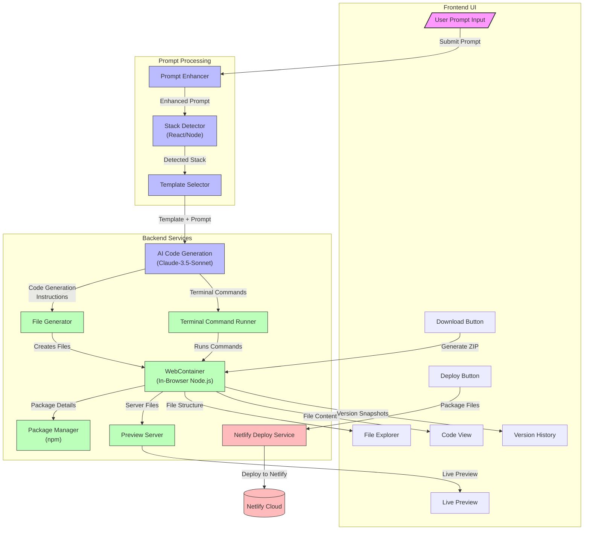

```mermaid
graph TB
    subgraph "Frontend UI"
        PromptInput[/"User Prompt Input"/]
        PreviewArea["Live Preview"]
        CodeView["Code View"]
        FileExplorer["File Explorer"]
        HistoryView["Version History"]
        DownloadBtn["Download Button"]
        DeployBtn["Deploy Button"]
    end

    subgraph "Prompt Processing"
        PromptEnhancer["Prompt Enhancer"]
        StackDetector["Stack Detector<br/>(React/Node)"]
        TemplateSelector["Template Selector"]
    end

    subgraph "Backend Services"
        AI["AI Code Generation<br/>(Claude-3.5-Sonnet)"]
        WebContainer["WebContainer<br/>(In-Browser Node.js)"]
        FileGenerator["File Generator"]
        PackageManager["Package Manager<br/>(npm)"]
        TerminalRunner["Terminal Command Runner"]
        PreviewServer["Preview Server"]
        DeployService["Netlify Deploy Service"]
    end

    %% Connect frontend to processing
    PromptInput -->|"Submit Prompt"| PromptEnhancer
    PromptEnhancer -->|"Enhanced Prompt"| StackDetector
    StackDetector -->|"Detected Stack"| TemplateSelector

    %% Connect processing to backend
    TemplateSelector -->|"Template + Prompt"| AI
    AI -->|"Code Generation<br/>Instructions"| FileGenerator
    AI -->|"Terminal Commands"| TerminalRunner
    FileGenerator -->|"Creates Files"| WebContainer
    TerminalRunner -->|"Runs Commands"| WebContainer
    WebContainer -->|"Package Details"| PackageManager
    WebContainer -->|"Server Files"| PreviewServer

    %% Connect backend to frontend display
    PreviewServer -->|"Live Preview"| PreviewArea
    WebContainer -->|"File Structure"| FileExplorer
    WebContainer -->|"File Contents"| CodeView
    WebContainer -->|"Version Snapshots"| HistoryView

    %% Export/Deploy flows
    DownloadBtn -->|"Generate ZIP"| WebContainer
    DeployBtn -->|"Package Files"| DeployService
    DeployService -->|"Deploy to Netlify"| NetlifyCloud[("Netlify Cloud")]

    %% Styling
    classDef userInput fill:#f9f,stroke:#333,stroke-width:2px
    classDef aiProcessor fill:#bbf,stroke:#333,stroke-width:1px
    classDef fileSystem fill:#bfb,stroke:#333,stroke-width:1px
    classDef deployment fill:#fbb,stroke:#333,stroke-width:1px

    class PromptInput userInput
    class PromptEnhancer,StackDetector,TemplateSelector,AI aiProcessor
    class FileGenerator,WebContainer,PackageManager,TerminalRunner,PreviewServer fileSystem
    class DeployService,NetlifyCloud deployment
```
